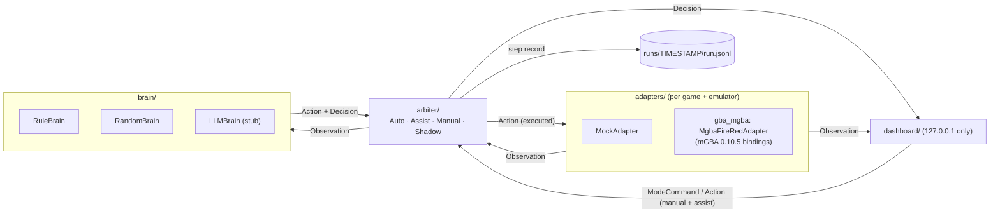

# game-brain

一個**唔綁定特定遊戲嘅「AI 大腦」**，用嚟自動玩遊戲。

- **Adapter** 將運行中嘅遊戲轉成 `Observation`。
- **Brain** 睇 `Observation`，決定 `Action`，再附一個人睇得明嘅 `Decision`。
- **Arbiter** 決定邊個大腦話事、個動作係咪真係執行，有四個模式：Auto / Assist / Manual / Shadow。
- 每一步都寫入 JSONL run log，可以 replay。

第一個目標遊戲：**Pokémon FireRed（美版）on mGBA**。

> **ROM 不包括在內。** 請自備合法 dump 嘅 ROM。ROM、存檔（`.sav`）、savestate、遊戲截圖同 `runs/` 全部已經寫入 `.gitignore`，**永遠唔好 commit**。

## 目前狀態（老實講）

| 項目 | 狀態 |
|---|---|
| 模擬器 | ✅ 用 mGBA 0.10.5 Python bindings **headless** 行真 FireRed（`--adapter mgba`）；決定性 act + replay 已驗證（見 [`notes/mgba-bridge.md`](notes/mgba-bridge.md)） |
| RuleBrain | ⚠️ 只係**狂按 A 過開場**，入到主角房間之後**行固定圖案亂行**；未有尋路、未有戰鬥邏輯 |
| RandomBrain | ✅ 有 seed、可重現嘅隨機按鍵（baseline / 後備） |
| LLMBrain | ⛔ **stub**：未接任何 LLM provider、無 API key、唔會打任何 API；呼叫時會回報 unavailable，arbiter 自動 fallback |
| RAM 位址 | 只有 [`notes/mgba-bridge.md`](notes/mgba-bridge.md) 表入面嗰啲係**喺呢隻 ROM 上驗證過**：`vblank_counter`、`held_keys`、`callback2`/`scene`、`player_x`/`player_y`、`map_bank`/`map_id`、`facing`。**`in_battle`、`party_count` 未驗證，mGBA adapter 暫時唔會輸出** |
| ROM | 我哋手上嗰隻 SHA1 係 `e0194282c427689768f8e618a285552f264524a4`，**唔係**乾淨 FireRed US 1.0（`41cb23d8dccc8ebd7c649cd8fbb58eeace6e2fdc`），亦唔係 Rev 1（`dd5945db…`），應該係改過嘅 image。所以 pokefirered 嘅位址全部要自己逐個驗證 |
| Dashboard | ✅ 本機網頁：即時畫面、計劃、最近步驟（顯示邊個做）、模式切換、Manual/Assist 手動按鍵 |
| CI | ⛔ 未有（現有 token 無 `workflow` scope，推唔到 `.github/workflows`） |
| License | 未揀（private repo，團隊之後決定） |

實測（2026-10-02，共用 box）：`--adapter mgba --steps 700 --mode auto` 跑 6744 frames，約 4.5 秒。喺 frame 4456（step 557）進入 overworld，主角出現喺 map 4/1（真新鎮主角屋 2F）嘅 (6,6)，之後喺房入面行，最後停喺 (4,5)。用同一個 log `replay()`，0 mismatch。

## 架構



訊息格式（`game_brain/schema`）全部係普通 JSON，帶 `type` 同 schema 版本 `v`：

| 訊息 | 方向 | 內容 |
|---|---|---|
| `Observation` | adapter → brain / dashboard | `frame`、`game`、`ram`（map bank/id、player x/y、facing…）、可選截圖 |
| `Action` | brain / 人手 → adapter | `ButtonPress(button, frames, release_frames)` 列表。**時間單位係 frame，唔係 ms**，所以可以重現 |
| `Decision` | brain → dashboard | `brain`、`plan`、`reason`、`mode`、`executed`、`actor` |
| `ModeCommand` | dashboard → arbiter | `mode` ∈ auto / assist / manual / shadow |

Dashboard 傳輸格式：`{type, frame, ts, payload}`（`to_envelope` / `from_envelope`），詳見 [`notes/dashboard-protocol.md`](notes/dashboard-protocol.md)。

## 快速開始

需要 Python ≥ 3.10。核心部分只用標準庫。

```bash
pip install -r requirements.txt        # 只得 pytest
```

### 1. Mock demo（唔使 ROM、唔使模擬器）

```bash
python -m game_brain.demo --adapter mock --steps 60 --mode auto
python -m game_brain.demo --adapter mock --steps 40 --mode shadow --switch 20:auto
python -m game_brain.demo --adapter mock --steps 20 --brains llm,rule   # LLM stub -> fallback 去 rule
python -m game_brain.dashboard --adapter mock --mode auto               # 開 http://127.0.0.1:8765/
```

### 2. 真 ROM（mGBA）

**前置條件：** mGBA 0.10.5 要由 source build，並且開 Python bindings。

- 用 `-DBUILD_PYTHON=ON -DUSE_FFMPEG=ON`。
- GCC 14 要加 `-Wno-incompatible-pointer-types`。
- 要裝 `cached_property`。
- 要裝 ffmpeg dev libs 等依賴。

完整步驟、原因同 RAM 驗證方法見 [`notes/mgba-bridge.md`](notes/mgba-bridge.md)。

喺**共用 box** 上，Backend 已經 build 好 mGBA，路徑如下（只適用於呢部 box）：

```bash
cd /workspace/game-brain            # 或者你自己嘅 clone
export PYTHONPATH=/workspace/mgba-src/build/python/lib.linux-x86_64-cpython-313
export LD_LIBRARY_PATH=/workspace/mgba-src/build
export GAME_BRAIN_ROM=<path to your FireRed ROM>   # ROM 路徑用 env 傳入，唔好放入 repo

python -m game_brain.demo --adapter mgba --steps 700 --mode auto   # headless，冇畫面
python -m game_brain.dashboard --adapter mgba                      # 開 http://127.0.0.1:8765/
```

- 喺自己部機，將上面兩個路徑換成你 build 出嚟嘅位置（`<build>/python/lib.linux-x86_64-cpython-3XX` 同 `<build>`）。
- 可選：設定 `GAME_BRAIN_START_STATE=<file>`，每次 `reset()` 就會載入嗰個 mGBA state，唔使由開機行起。檔案放本機，`*.state` 已經 gitignore。

> ⚠️ 喺共用 box 撳 **「Update Computer」** 會清走用 apt 裝嘅 libs（例如 ffmpeg dev libs），之後 mGBA 要**重新 build**，`--adapter mgba` 先會再用得。

### Dashboard 只綁 127.0.0.1（刻意設計）

Dashboard 可以控制遊戲，所以**只會 bind 嗰部機嘅 127.0.0.1**。用 `--host 0.0.0.0` 會直接報錯拒絕，唔好試圖改成對外開放。

- **喺共用 box 行：** 請喺 **box 自己嘅桌面瀏覽器**打開 http://127.0.0.1:8765/。喺你自己電腦嘅瀏覽器開係連唔到嘅。
- **想喺自己電腦睇：** 喺自己部機裝 mGBA（build bindings）同 ROM，然後本機行。
- 經 SSH tunnel 遠端睇，之後先補文件。**永遠唔好 bind 0.0.0.0。**

## 四個模式同 `actor` 欄位

| 模式 | 問唔問大腦 | 大腦動作會唔會執行 | Dashboard / 人手按鍵 |
|---|---|---|---|
| **auto** | 問 | 會 | 拒絕 |
| **assist** | 問（除非有人手動作排緊隊） | 會（除非被人手搶先） | **接受，並且插隊優先執行**；人手動作做完，大腦自動接返 |
| **manual** | 唔問 | 唔會（brain 動作一律拒絕） | 接受，按次序執行；無排隊就原地等 |
| **shadow** | 問 | **唔會**，只記錄提議；遊戲照等同樣 frame 數 | 拒絕 |

每個 `Decision` 都有 **`actor`** 欄位，記錄呢一步實際係邊個做：

- `"brain"`：大腦出嘅動作。Shadow 模式下只係提議，`executed: false`。
- `"human"`：執行咗 dashboard / 人手排隊嘅動作。喺 Assist 即係**呢一步大腦被搶先**。
- `"none"`：原地等（Manual 冇排隊，或者冇大腦可用）。

舊 log 冇 `actor` 欄位，讀入時當 `"brain"`。

另外：
- Arbiter 有大腦優先次序，例如 `--brains llm,rule,random`。前面嘅大腦 unavailable 或者出錯，就自動 fallback 去下一個。
- 設計細節見 [`notes/design.md`](notes/design.md)。

## Run log 同 replay

每次 demo / dashboard 都會寫 `runs/<timestamp>/run.jsonl`（gitignored；可以用 `--out` 改目錄）。一行一筆：

- `header`：adapter、brains、mode、seed
- `step`：`step`、`frame`、`mode`、`observation`（RAM 摘要，唔包截圖）、`decision`（包括 `actor`）、`proposed_action`、`executed_action`、`frames_advanced`、`notes`
- `mode_change`、`summary`

Replay 會將 log 入面每一步嘅 `executed_action`（包括人手動作）喺一個新 reset 嘅 adapter 上重做一次，逐步比較 `frame` 同 RAM：

```bash
python -c "
from game_brain.runlog import replay
from game_brain.adapters import make_adapter
print(replay('runs/<timestamp>/run.jsonl', make_adapter('mock')))   # [] = 完全一致
"
```

真 ROM 嘅 log 就用 `make_adapter('mgba')`，而且要設定同上面一樣嘅 env。因為時間全部用 frame 計，又冇 wall-clock sleep，同一個起點加同一串 Action 一定得到同一個結果。範例 log：[`examples/mock_run.jsonl`](examples/mock_run.jsonl)（mock 遊戲，合成數據）。

## 測試

```bash
python -m pytest -q
```

- 冇 mGBA bindings 或者冇 `GAME_BRAIN_ROM` 嘅時候，真 ROM 測試（`tests/test_mgba_adapter.py` 其中 5 個）會 **skip**，其餘照跑。
- 兩樣都設定好，就會全部跑。

## 目錄

```
game_brain/
  schema/       訊息 + JSON / envelope (de)serialisation
  brain/        Brain interface, RuleBrain, RandomBrain, LLMBrain stub
  arbiter/      模式處理 + brain fallback
  adapters/     Adapter interface, MockAdapter, gba_mgba/ (MgbaFireRedAdapter + FireRed RAM map)
  dashboard/    本機網頁 dashboard（HTTP + WebSocket，只用標準庫）+ live loop
  runlog.py     JSONL writer / reader / replay
  demo.py       end-to-end loop CLI
examples/mock_run.jsonl   細份合成 run log（mock 遊戲，無遊戲數據）
notes/          design.md, adapter-interface.md, mgba-bridge.md, dashboard-protocol.md, references.md
tests/          pytest
```

## Roadmap（第 0–2 週目標：由真新鎮行到常青市道館門口）

1. **驗證 `in_battle`、`party_count`**：要先去到攞咗御三家、打過第一場戰嘅 state，用同 `mgba-bridge.md` 一樣嘅方法逐個驗證，之後先輸出。
2. **行路大腦**：讀地圖 / 碰撞資料，用 A* 尋路，取代而家嘅固定圖案；處理門口、樓梯、轉 map。
3. **戰鬥大腦**：基本揀招、換隻、逃走；需要 (1) 先完成。
4. **LLM planner**：揀好 provider、有 API key 之後，先實作 `LLMBrain`（高層計劃，交俾規則 / 尋路大腦執行）。
5. **CI**：token 有 `workflow` scope 之後先加 GitHub Actions，跑 `pytest`（mock 部分）。

參考資料：[`notes/references.md`](notes/references.md)（Research Manager 整理）。
