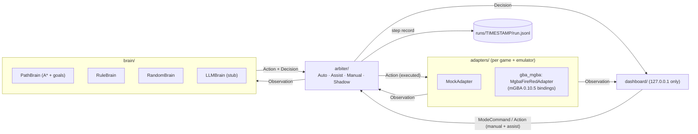

# game-brain

一個**唔綁定特定遊戲嘅「AI 大腦」**，用嚟自動玩遊戲。

- **Adapter** 將運行中嘅遊戲轉成 `Observation`。
- **Brain** 睇 `Observation`，決定 `Action`，再附一個人睇得明嘅 `Decision`。
- **Arbiter** 決定邊個大腦話事、個動作係咪真係執行，有四個模式：Auto / Assist / Manual / Shadow。
- 每一步都寫入 JSONL run log，可以 replay。
- 跨次運行嘅 SQLite 經驗／探索記憶放喺 repo 外；記錄實際動作前後狀態，**唔等於模型已學會玩**。

第一個目標遊戲：**Pokémon FireRed（美版）on mGBA**。

> **ROM 不包括在內。** 請自備合法 dump 嘅 ROM。ROM、存檔（`.sav`）、savestate、遊戲截圖同 `runs/` 全部已經寫入 `.gitignore`，**永遠唔好 commit**。

## 目前狀態（老實講）

> **最後更新：2026-10-02 12:50，main 已 merge 到 PR #18。** YIN 已確認開工做下一個 task（勁敵戰），分工如下：
>
> | 負責 | Task | 狀態 |
> |---|---|---|
> | Backend | 驗證 `ram["battle"]`：選單/游標、雙方 HP、等級、招式、PP；試埋輸咗劇情係咪照行 | 🔄 進行中（初步：戰鬥寵物資料由 `0x02023BE4` 起、每隻 `0x58`；主選單游標 `0x02023FF8`，0–3 = FIGHT/BAG/POKéMON/RUN，**未 merge 前當未驗證**） |
> | Fullstack | RuleBattleBrain＋PokeAPI 靜態表，先用 mock，`ram["battle"]` merge 後接真 ROM | 🔄 進行中 |
> | Frontend | 戰鬥面板（`intent`、`battle` 等欄位） | ⏳ 等上面兩個 merge |
>
> ⚠️ 呢隻 ROM 嘅御三家**只識 METRONOME（揮指）**，所以勁敵戰結果係隨機；RuleBattleBrain 唔可以假設識咩招，要由 `ram["battle"]` 讀。
>
> **進度一句講晒**：AI 已經可以喺真 ROM 上由開機自己行到研究所、攞到妙蛙種子（M1 ✅、M2 前半 ✅）。**下一步**係第一場勁敵戰：要先驗證戰鬥 RAM（`ram["battle"]`），再寫 RuleBattleBrain。

| 項目 | 狀態 |
|---|---|
| 模擬器 | ✅ 用 mGBA 0.10.5 Python bindings **headless** 行真 FireRed（`--adapter mgba`）；決定性 act + replay 已驗證（見 [`notes/mgba-bridge.md`](notes/mgba-bridge.md)） |
| RuleBrain | ⚠️ 只係**狂按 A 過開場**，入到主角房間之後**行固定圖案亂行**；而家主要做 PathBrain 嘅後備 |
| PathBrain | ✅ **A\* 尋路**（4 方向）＋目標清單：真 ROM 上由主角房 2F → 1F → 真新鎮 → 北面出口觸發 Oak 劇情 → 研究所 → **攞到妙蛙種子（Bulbasaur，`party_count` 1）**；會避開 NPC、會按 A/B 過劇情。攞完之後行向出口，勁敵喺 (7,8) 截停 → 交俾戰鬥大腦；打完（贏輸都得）返到 (7,8)。**M3**：出研究所 → 行出真新鎮北面邊界（map connection，唔係 warp）→ 1 號道路 3/19（草叢野生戰交俾戰鬥大腦）→ 行出北面邊界 → **常磐市 3/1**。**Oak 包裹**：入常磐市友好商店 5/3（店員劇情自動俾包裹）→ 經 1 號道路行返南面（跳台當牆，A\* 行冇跳台嗰條路）→ 研究所交俾 Oak → **攞到圖鑑**（真 ROM 由開機 step 3944）。下一個目標（往尼比市）係 placeholder，對白完咗原地等。**輸咗（whiteout）**：喺屋企 1F (8,5) 醒返，媽媽補返血，AI 會自己再行出去、行返去常磐市（真 ROM 驗證，見 `notes/nav.md`「Whiteout」） |
| RandomBrain | ✅ 有 seed、可重現嘅隨機按鍵（baseline / 後備） |
| LLMBrain | ⛔ **stub**：未接任何 LLM provider、無 API key、唔會打任何 API；呼叫時會回報 unavailable，arbiter 自動 fallback |
| RAM 位址 | 只有 [`notes/mgba-bridge.md`](notes/mgba-bridge.md) 表入面嗰啲係**喺呢隻 ROM 上驗證過**：`vblank_counter`、`held_keys`、`callback2`/`scene`、`player_x`/`player_y`、`map_bank`/`map_id`、`facing`、`map_w`/`map_h`/`collision`/`warps`（PR #7）；`npcs`、`party_count`（M2，暫放喺 `adapters/gba_mgba/firered_extra.py`，驗證方法見 [`notes/nav.md`](notes/nav.md)，**等 Backend 接手**）。`in_battle`（`gMain+0x439` bit1，PR #15，喺勁敵戰驗證：對戰期間 True，完咗返 False；入戰前約 20 步過場仍然係 False）。`npcs` 用碰撞法 8 個只驗到 1 個，當**部分驗證** |
| ROM | 我哋手上嗰隻 SHA1 係 `e0194282c427689768f8e618a285552f264524a4`，**唔係**乾淨 FireRed US 1.0（`41cb23d8dccc8ebd7c649cd8fbb58eeace6e2fdc`），亦唔係 Rev 1（`dd5945db…`），應該係改過嘅 image。所以 pokefirered 嘅位址全部要自己逐個驗證 |
| Dashboard | ✅ 本機網頁：即時畫面、計劃、最近步驟（顯示邊個做）、模式切換、Manual/Assist 手動按鍵；目標、里程碑進度條、小地圖（碰撞格、出入口、規劃路徑、紫色 NPC）、隊伍數量；新增跨次記憶總覽（操作／新奇獎勵／低訪問格子）及遊戲／探索存檔、續玩路徑 |
| Docker | ✅ 本機 image（PR #13）：ROM 以唯讀 `-v` 掛入、唔會 COPY 入 image；只開 `127.0.0.1:8765` |
| Run log | ✅ 去重（PR #9/#11/#14）：每張地圖嘅碰撞格只記一次、`milestones`/`npcs`/`executed_action` 有變先記；1500 步 log 約 1.35 MB，replay 照樣 0 mismatch |
| 戰鬥大腦 | ✅ **RuleBattleBrain**（`--brains battle,path,rule`）：讀 `ram["battle"]`（PR #20），用 PokeAPI 靜態表（`game_brain/data/`，BSD-3，見 `NOTICE.md`）估傷害揀招，逐步閉環撳掣（睇選單同游標）。真 ROM：由開機打完勁敵戰（揮指，今次贏）、返到研究所 (7,8)，replay 0 mismatch。信心低過門檻（預設 0.6，`--battle-confidence`）喺 Assist 會 `handoff` 等人。未做：換隻、用道具（隊伍/背包未讀到）；RUN 預設唔用 |
| CI | ⛔ 未有（現有 token 無 `workflow` scope，推唔到 `.github/workflows`） |
| License | 未揀（等 YIN 決定；repo 目前係 public） |

實測（2026-10-02，共用 box）：

- **RuleBrain 單獨跑**：`--adapter mgba --steps 700 --mode auto` 跑 6744 frames，約 4.5 秒。喺 frame 4456（step 557）進入 overworld，主角出現喺 map 4/1（真新鎮主角屋 2F）嘅 (6,6)，之後喺房入面亂行。
- **PathBrain（M1）**：`--adapter mgba --brains path,rule --steps 700` 喺 step 575（frame 4832）落到 1F（4/0），step 594（frame 5244）出到**真新鎮 3/0**。
- **PathBrain（M2）**：`--steps 1500` 由開機跑到：
  - step 618（frame 5708）行到北面出口 (12,1)，Oak 劇情開始；
  - step 699（frame 6996）被帶入研究所（4/3）；
  - step 923（frame 9238）對白完可以郁，行去 (8,5) 面向左邊個波；
  - step 963（frame 9890）`party_count` 變 1（攞到妙蛙種子）；
  - step 1050（frame 11018）對白完（改名問題答「唔要」），之後企定喺 (8,5) 等。
- 所有 log 用 `replay()` 都係 0 mismatch。

## 架構



訊息格式（`game_brain/schema`）全部係普通 JSON，帶 `type` 同 schema 版本 `v`：

| 訊息 | 方向 | 內容 |
|---|---|---|
| `Observation` | adapter → brain / dashboard | `frame`、`game`、`ram`（map bank/id、player x/y、facing…）、可選截圖 |
| `Action` | brain / 人手 → adapter | `ButtonPress(button, frames, release_frames)` 列表。**時間單位係 frame，唔係 ms**，所以可以重現 |
| `Decision` | brain → dashboard | `brain`、`plan`、`reason`、`mode`、`executed`、`actor` |
| `ModeCommand` | dashboard → arbiter | `mode` ∈ auto / assist / manual / shadow |

Dashboard 傳輸格式：`{type, frame, ts, payload}`（`to_envelope` / `from_envelope`），詳見 [`notes/dashboard-protocol.md`](notes/dashboard-protocol.md)。

## 快速開始

需要 Python ≥ 3.10。核心部分只用標準庫。

```bash
pip install -r requirements.txt        # 只得 pytest
```

### 1. Mock demo（唔使 ROM、唔使模擬器）

```bash
python -m game_brain.demo --adapter mock --steps 60 --mode auto
python -m game_brain.demo --adapter mock --steps 40 --mode shadow --switch 20:auto
python -m game_brain.demo --adapter mock --steps 20 --brains llm,rule   # LLM stub -> fallback 去 rule
python -m game_brain.demo --adapter mock-house --brains path,rule --steps 250  # PathBrain 行出合成「屋企」，再行到研究所攞御三家
python -m game_brain.dashboard --adapter mock --mode auto               # 開 http://127.0.0.1:8765/
```

### 2. 真 ROM（mGBA）

**前置條件：** mGBA 0.10.5 要由 source build，並且開 Python bindings。

- 用 `-DBUILD_PYTHON=ON -DUSE_FFMPEG=ON`。
- GCC 14 要加 `-Wno-incompatible-pointer-types`。
- 要裝 `cached_property`。
- 要裝 ffmpeg dev libs 等依賴。

完整步驟、原因同 RAM 驗證方法見 [`notes/mgba-bridge.md`](notes/mgba-bridge.md)。

喺**共用 box** 上，Backend 已經 build 好 mGBA，路徑如下（只適用於呢部 box）：

```bash
cd /workspace/game-brain            # 或者你自己嘅 clone
export PYTHONPATH=/workspace/mgba-src/build/python/lib.linux-x86_64-cpython-313
export LD_LIBRARY_PATH=/workspace/mgba-src/build
export GAME_BRAIN_ROM=<path to your FireRed ROM>   # ROM 路徑用 env 傳入，唔好放入 repo

python -m game_brain.demo --adapter mgba --steps 700 --mode auto   # headless，冇畫面
python -m game_brain.dashboard --adapter mgba                      # 開 http://127.0.0.1:8765/
```

- **Dashboard 同 CLI 共用同一套 setup**（[`game_brain/setup.py`](game_brain/setup.py)）：adapter（連 collision / NPC / 隊伍 RAM）、大腦清單、里程碑、戰鬥信心門檻、自動存檔 / 續玩都喺度砌，`demo.py` 同 `dashboard/live.py` 都用佢，旗標一樣（`--adapter --mode --brains --battle-confidence --seed --starter --out --save-dir --save-every --keep-periodic --no-save --resume`）。
- `--starter random|bulbasaur|charmander|squirtle`：**預設 `random`**（或者 `$GAME_BRAIN_STARTER`；Docker：`GAME_BRAIN_STARTER=squirtle docker compose up`）。`random` 由 seed 決定（同一個 seed 永遠揀同一隻：seed 0 → bulbasaur、1 → charmander、2 → squirtle）。**冇俾 `--seed` 就自動抽一個 seed**（`secrets.randbits(32)`），寫入 log header（`seed`、`seed_source: "auto"`）、status、summary 同存檔；用 `--seed <嗰個數>` 可以重現成個 run，`--resume` 自動用返存檔嘅 seed。固定 starter 冇 `--seed` 就照舊用 0；指定一隻就用 `--starter charmander` 等。log header、`starter` event、`starter_picked` event、dashboard `status`、summary 同每個存檔 sidecar 都有 `starter: {"requested", "picked", "seed"}`（`picked` 喺研究所攞波之前係 `null`）。`--resume` 用存檔記錄，唔會重新抽。
- Dashboard 預設：`--adapter auto`（有 `$GAME_BRAIN_ROM` 檔就用 mgba，冇就用 mock 兼喺 stderr 警告）、`--brains battle,path,rule`（同 Dockerfile CMD 一樣）。CLI 預設維持 `mock` / `rule,random`。

- 喺自己部機，將上面兩個路徑換成你 build 出嚟嘅位置（`<build>/python/lib.linux-x86_64-cpython-3XX` 同 `<build>`）。
- 可選：設定 `GAME_BRAIN_START_STATE=<file>`，每次 `reset()` 就會載入嗰個 mGBA state，唔使由開機行起。檔案放本機，`*.state` 已經 gitignore。

> ⚠️ 喺共用 box 撳 **「Update Computer」** 會清走用 apt 裝嘅 libs（例如 ffmpeg dev libs），之後 mGBA 要**重新 build**，`--adapter mgba` 先會再用得。

### Dashboard 只綁 127.0.0.1（刻意設計）

Dashboard 可以控制遊戲，所以**只會 bind 嗰部機嘅 127.0.0.1**。用 `--host 0.0.0.0` 會直接報錯拒絕，唔好試圖改成對外開放。唯一例外係喺 game-brain 嘅 Docker container 入面（見下面「Docker」），而且 host 嗰邊都係只開 127.0.0.1。

- **喺共用 box 行：** 請喺 **box 自己嘅桌面瀏覽器**打開 http://127.0.0.1:8765/。喺你自己電腦嘅瀏覽器開係連唔到嘅。
- **想喺自己電腦睇：** 喺自己部機裝 mGBA（build bindings）同 ROM，然後本機行。
- 經 SSH tunnel 遠端睇，之後先補文件。**永遠唔好 bind 0.0.0.0。**

### 3. Docker（本機用，唔使自己 build mGBA）

Image 入面會由 source build mGBA 0.10.5（開 Python bindings 同 `USE_FFMPEG`），再裝 game-brain；mGBA build 同最終 image 共用執行期套件層，避免重複安裝。測試檔同測試用範例會保留（可用 `docker run ... python3 -m pytest`），設計文件唔會放入 image。**ROM 同 save state 唔會 COPY 入 image**，淨係喺行嘅時候用 `-v ...:ro` 唯讀掛入去。Image 只喺本機用，唔好 push 去任何 registry。

喺 Windows 用 `start_in_docker.bat` 啟動時，首次會輸入 ROM 路徑並儲存到 `%USERPROFILE%\.game-brain\rom-path.txt`；之後會自動沿用。若檔案搬走或刪除，啟動時會要求輸入新路徑。ROM 路徑只保存在本機，唔會加入 repo 或 Docker image。想直接喺 Windows 行、唔用 Docker，請用 `start_local.bat`；本機 Python 要已安裝 mGBA 0.10.x bindings，設定方法見 [`notes/mgba-bridge.md`](notes/mgba-bridge.md)。

```bash
docker build -t game-brain:local .        # 第一次大約幾分鐘（要 build mGBA）

# Dashboard（預設 `--brains battle,path,rule`）：host 嗰邊只開 127.0.0.1，開 http://127.0.0.1:8765/
docker run --rm -p 127.0.0.1:8765:8765 \
  -v /abs/path/firered.gba:/data/rom.gba:ro \
  -v "$PWD/runs":/app/runs \
  game-brain:local

# Headless demo / 測試
docker run --rm -v /abs/path/firered.gba:/data/rom.gba:ro -v "$PWD/runs":/app/runs \
  game-brain:local python3 -m game_brain.demo --adapter mgba --brains battle,path,rule --steps 2600
docker run --rm -v /abs/path/firered.gba:/data/rom.gba:ro game-brain:local python3 -m pytest -q

# 或者用 compose（設定好 ROM 路徑先）
GAME_BRAIN_ROM_FILE=/abs/path/firered.gba docker compose up --build
```

- `./runs` 要畀 uid 1000 寫得到（container 用非 root 嘅 `brain` user 行）。
- 想由某個 state 開始：加 `-v /abs/path/x.state:/data/start.state:ro -e GAME_BRAIN_START_STATE=/data/start.state`。
- Compose 會將經驗 SQLite 同探索存檔放喺 `brain-memory` named volume（container 內 `/memory`）；重建 image、重啟或普通 `docker compose down` 唔會清除。**`docker compose down -v` 會刪除記憶 volume。** 直接 `docker run --rm` 請另加 `-v game-brain-memory:/memory`，否則 container 刪除時記憶亦會消失。

**點解 container 入面要 bind `0.0.0.0`：** `-p` 會將 host 嘅 port 轉去 container 嘅網卡，唔係 container 自己嘅 loopback。如果 container 入面只 bind 127.0.0.1，host 就連唔到。所以 image 設咗 `GAME_BRAIN_IN_CONTAINER=1`，dashboard 只會喺**同時**有呢個 env 同埋有 `/.dockerenv` 或 `/run/.containerenv` 嘅時候先接受 `0.0.0.0`；其他位址（LAN IP、`::`）照樣拒絕，喺普通機設咗 env 都冇用。

**對外仍然只係 localhost：** 一定要寫 `-p 127.0.0.1:8765:8765`。**唔好**寫 `-p 8765:8765`，咁樣 Docker 會開喺 host 所有網卡上面。WebSocket 嘅 Origin 檢查冇改：`http://127.0.0.1:8765` 同 `http://localhost:8765` 通過，其他 origin 照樣 403。

## 四個模式同 `actor` 欄位

| 模式 | 問唔問大腦 | 大腦動作會唔會執行 | Dashboard / 人手按鍵 |
|---|---|---|---|
| **auto** | 問 | 會 | 拒絕 |
| **assist** | 問（除非有人手動作排緊隊） | 會（除非被人手搶先） | **接受，並且插隊優先執行**；人手動作做完，大腦自動接返 |
| **manual** | 唔問 | 唔會（brain 動作一律拒絕） | 接受，按次序執行；無排隊就原地等 |
| **shadow** | 問 | **唔會**，只記錄提議；遊戲照等同樣 frame 數 | 拒絕 |

每個 `Decision` 都有 **`actor`** 欄位，記錄呢一步實際係邊個做：

- `"brain"`：大腦出嘅動作。Shadow 模式下只係提議，`executed: false`。
- `"human"`：執行咗 dashboard / 人手排隊嘅動作。喺 Assist 即係**呢一步大腦被搶先**。
- `"none"`：原地等（Manual 冇排隊，或者冇大腦可用）。

舊 log 冇 `actor` 欄位，讀入時當 `"brain"`。

另外：
- Arbiter 有大腦優先次序，例如 `--brains llm,rule,random`。前面嘅大腦 unavailable 或者出錯，就自動 fallback 去下一個。
- 設計細節見 [`notes/design.md`](notes/design.md)。

## 跨次運行記憶（第一版，唔係模型訓練）

CLI 同 Dashboard 預設累積記憶，儲存喺 `~/.game-brain/memory`（Windows：`%USERPROFILE%\.game-brain\memory`）。可用 `--memory-dir DIR` 或 `GAME_BRAIN_MEMORY_DIR` 更改，repo 內目錄會被拒絕；`--no-memory` 關閉 SQLite 同探索存檔，JSONL 仍記錄動作前後狀態。`--no-save` 關閉普通及探索存檔，但唔會關閉經驗記錄。

| 資料 | 保存內容 |
|---|---|
| `experience.sqlite3` | `runs`、`episodes`、`transitions`、`discoveries`、`cells`；每個已完成動作獨立 transaction，存 before / **實際** action / after、reward 分項、actor、mode、policy/git 版本、ROM SHA1、schema/reward 版本 |
| `exploration/<run_id>/` | 每個新 cell 嘅第一個代表 `.state` + `.json`（可有 `.sav`）；同普通 `--save-dir` 分開，唔影響普通 `--resume latest` |
| JSONL | 保留原始提議同實際動作、RAM 摘要、停止／存檔事件；無權重、無 PPO 更新 |

Cell 用精確 `(map_bank, map_id, x, y, party_count, milestones_done)`，不計 facing；戰鬥、無座標或非 overworld 唔建立 cell。`cells.visits` 跨 run 累積，可查少探索位置，再用代表存檔 `--resume <save>` 出發。第一版**唔會自動選 cell／改變大腦決策**，亦未做完整 Go-Explore controller、最短路徑替換或模型訓練。存檔數隨 cell 數增長，未設淘汰上限；探索時間長時要留意磁碟容量。

首次新格 +1、新地圖 +5、planner 判定新里程碑 +10、隊伍首次達到新數量 +10。新奇獎勵按 adapter + **ROM SHA1** 跨 run 去重，來回行、讀檔、重新開機唔會重新領取；起點已存在嘅進度只做基線、唔加分。戰鬥只計明確 `outcome` 變化：同地圖／對手首次勝利 +5、明確 `lose` -10（唔用單隻 HP=0 猜全滅）；重複補血唔加分。對白／選單可唔郁，暫不猜測「卡住」或未驗證嘅 RAM 劇情旗標。呢啲係版本化嘅記錄指標，**唔係評估成績**。

Shadow 寫入實際 `NONE` 等待，experience 嘅 actor 為 `none`，唔將 AI 提議當成已執行；Manual／Assist 接管記人手動作。每次開機／`--resume` 都開新 episode，sidecar 保存父 run、episode、恢復步數。第一個任務終點為「有御三家並到達常磐市 3/1」（`terminated`）；普通結束／步數上限／訊號停止為 `truncated`。到達任務後可繼續原本運行，但後續操作屬新 episode。強制中斷／崩潰未完成步驟唔會冒充完整經驗；未正常結束嘅 run 在 SQLite 保持 `ended_at = NULL`。

```bash
# 查看記憶統計、少探索 cell 同可 --resume 嘅 save 路徑
python -m game_brain.memory
# 多個 adapter / ROM 共用同一目錄時，要選輸出列出嘅 namespace
python -m game_brain.memory --namespace "gba_mgba/firered:<ROM_SHA1>"
# 匯出 cell 資料顯示嘅 run_id / step_id 到該位置嘅實際軌跡
python -m game_brain.memory --route "<run_id>:<step_id>"
# Docker Compose volume 內檢查
docker compose exec dashboard python3 -m game_brain.memory
```

`--route` 只接父軌跡至**讀檔點之前**，唔接被放棄嘅舊 run 尾段。由外來／舊存檔開始而冇父經驗時，路徑只由該 episode 起點開始，唔聲稱由開機到達；如果 sidecar 指向其他已遺失嘅記憶庫，匯出會明確報錯。備份時停程式後複製成個 memory 目錄（包含 SQLite 同探索存檔）；普通 saves 要另行備份，JSONL 仍喺 `--out`。

## Run log 同 replay

每次 demo / dashboard 都會寫 `runs/<run_id>/run.jsonl`（`run_id` = UTC 開始時間加隨機識別尾碼，例如 `20261002T083408Z-012345abcdef`，避免同秒運行覆蓋記憶／存檔）（gitignored；可以用 `--out` 改目錄）。舊 ID 照樣可以續玩。一行一筆：

- `header`：adapter、brains、mode、seed
- `step`：`step`、`frame`、`mode`、`observation`（動作前 RAM 摘要，唔包截圖）、`observation_after`（執行後重新觀察，包括最後一步）、`decision`（包括 `actor`）、`proposed_action`、`executed_action`、`frames_advanced`、`notes`；開啟記憶時亦有 `experience`（episode、獎勵分項、版本、終止旗標）
- `episode_end`：正常結束／步數上限／停止訊號嘅軌跡邊界；`iter_steps()` 將最後一步嘅 `truncated` 還原，`replay()` 亦會核對動作後狀態。舊 log 冇動作後資料仍可 replay。
- `mode_change`、`summary`

為咗慳位，log 檔入面有啲嘢只係「有變先寫」（dashboard live 收到嘅 envelope 永遠係完整，唔受影響）：

- `map`：collision / warps / map size 每張地圖寫一次，`step` 用 `observation.map_ref` 指返去
- `decision.milestones`：同上一步一樣就唔寫，`step` 改為帶 `"milestones_same": true`
- `executed_action`：同 `proposed_action` 一樣就唔寫，`step` 改為帶 `"executed_same": true`；真係冇執行動作就照寫 `"executed_action": null`

讀 log 請用 `game_brain.runlog.iter_steps()`（`replay()` 都係用佢），佢會將以上全部還原；舊 log 照讀，結果一樣。

Replay 會將 log 入面每一步嘅 `executed_action`（包括人手動作）喺一個新 reset 嘅 adapter 上重做一次，逐步比較 `frame` 同 RAM：

```bash
python -c "
from game_brain.runlog import replay
from game_brain.adapters import make_adapter
print(replay('runs/<timestamp>/run.jsonl', make_adapter('mock')))   # [] = 完全一致
"
```

真 ROM 嘅 log 就用 `make_adapter('mgba')`，而且要設定同上面一樣嘅 env。因為時間全部用 frame 計，又冇 wall-clock sleep，同一個起點加同一串 Action 一定得到同一個結果。範例 log：[`examples/mock_run.jsonl`](examples/mock_run.jsonl)（mock 遊戲，合成數據）。

## Save / resume（存檔同續玩）

```bash
# 預設存去 ~/.game-brain/saves（或者 $GAME_BRAIN_SAVE_DIR）；每到一個里程碑、每 500 步、同埋完結都會存
python -m game_brain.demo --adapter mgba --brains battle,path,rule --steps 3000 --save-every 500
# 由最新嗰個存檔繼續（或者俾 .json / .state 路徑）
python -m game_brain.demo --adapter mgba --brains battle,path,rule --steps 1000 --resume latest
```

- 定期存檔（`--save-every`）每個 run 只留最新 `--keep-periodic N` 個（預設 10；`0` = 全部留）；舊嘅連 `.state`、`.sav` 一齊刪。**只會刪 sidecar `reason` 係 `"periodic"` 嘅**，里程碑、`final` 同其他存檔永遠唔刪。
- `<save_dir>/latest` 記住最新存檔**相對 save dir 嘅路徑**，所以將存檔目錄搬走 / 喺 Docker（`/saves`）同 host（`~/.game-brain/saves`）之間用都可以 `--resume latest`；舊嘅絕對路徑 pointer 照讀。

- 每個存檔：`.state`（mGBA save state，主要）＋`.json` sidecar（step、frame、地圖、座標、里程碑、HP（有先有）、ROM SHA1、brains、git commit、時間）＋`.sav`（遊戲入面自己 SAVE 過先有，只係備份）。
- **停止：** Ctrl-C 或者 SIGTERM（`docker compose down`）會做完而家呢一步，再寫 `final` 存檔同 summary，exit 0。**第二次** Ctrl-C / SIGTERM 即刻強制停（例如一步卡死咗）：冇 `final` 存檔（遊戲可能停喺一步中間），用返最後一個里程碑 / 定期存檔續玩，exit code 128 + 訊號（SIGINT 130、SIGTERM 143）。
- **存檔目錄唔可以喺 repo 入面**（repo 係 public）：會直接拒絕。`--no-save` 唔存。
- 續玩：檢查 ROM SHA1 → 載入 state → 還原里程碑 → step / frame 由存檔嗰度繼續；log header 有 `resumed_from`，`replay()` 會自動由同一個 state 開始。
- Dashboard（`live.py`）用同一套旗標自動存檔 / 續玩（`--resume latest` 等）。`compose.yaml` 將 host 嘅 `${GAME_BRAIN_SAVE_DIR_HOST:-<home>/.game-brain/saves}` mount 去 container 嘅 `/saves`（`--save-dir /saves`）；Linux 要先 `mkdir -p ~/.game-brain/saves`（container 用戶係 uid 1000 `brain`，唔係就會變 root 擁有、寫唔到），`start.bat` 會自動開 `%USERPROFILE%\.game-brain\saves`。未喺 Docker 實測（box 上 docker daemon 用唔到）。
- 格式：[`notes/savestate-format.md`](notes/savestate-format.md)。

## PathBrain（自動尋路）

```bash
python -m game_brain.demo --adapter mgba --brains path,rule --steps 1100  # 真 ROM（env 同上），行到攞到妙蛙種子
```

- **目標清單**（`game_brain/brain/goals.py`）：
  - M1：過開場（RuleBrain 狂按 A）→ 離開睡房（2F 樓梯）→ 離開屋企（1F 門口地氈）→ 企喺真新鎮。
  - M2：行去真新鎮北面出口（(12,1)，Oak 會截住你）→ Oak 劇情帶你入研究所（狂按 A）→ 揀**妙蛙種子**（左邊個波 (8,4)：企 (8,5)、面向上、撳 A、答 YES）→ `party_count` 1。
  - 之後係第一場勁敵戰：PathBrain 先用 **B** 過埋剩低嘅對白（改名問題 B = 唔要，唔會入改名畫面），再行向出口；勁敵截停之後，`in_battle` 期間由 RuleBattleBrain 打（冇 `battle` brain 就由 RuleBrain 狂撳 A）。打完返到 (7,8)，下一個目標（1 號道路）係 placeholder，原地等。
  - 戰鬥期間 PathBrain 冇被問，但 arbiter 會俾佢 `observe` 每個 observation，所以里程碑照更新，每一步都有 `milestones`。
  - 點解揀妙蛙種子：對頭兩個道館（小剛、小霞）都有屬性優勢，最易練。改 `firered_milestones("CHARMANDER")` 就可以揀第二隻。
- **地圖**：由 `Observation.ram` 嘅 `map_w`/`map_h`/`collision`/`warps` 讀（`RamMapProvider`），每張 map 只 parse 一次。
  - `warps` 只用 `enter` 唔係 `null` 嘅。
  - Warp 格可行，就企上去撳 `enter`（地氈、樓梯）。
  - Warp 格係牆，就由後面嗰格行 `enter` 方向入去（門）。
- **每一步**：
  - 唔係面向要行嘅方向，就先輕按一下轉身；之後一個 Action 行一格。
  - 轉 map 之後，等位置穩定先再行。
  - 轉唔到身：當角色被凍結（淡入、劇情），等。
  - **NPC**：`ram["npcs"]` 入面每個 NPC 企嘅格（同佢行緊嗰陣嘅上一格）**未撞之前**已經當障礙。
  - 行唔到：先撳 A（可能係對話框）再試；同一格失敗兩次就當有 NPC 擋住，暫時封咗嗰格，再用 A\* 重新規劃（`npcs` 冇列到嘅障礙用呢個後備）。
  - **劇情**：轉唔到身 = 角色被凍結，就隔一次撳一下 A（或者目標指定嘅 B）；有步數上限，超過就交返俾後備 brain，唔會無限 loop。
- **Decision 新增**（可選，dashboard 可以畫）：`goal`、`path`（`[[x,y],…]`，第一個係現位置）、`milestones`（`[{id,label,done}]`）。PathBrain 交俾 RuleBrain 做嘅 step（例如開場），arbiter 都會抄埋 `milestones` 落去，所以**每一步都有**。
- 詳細合約同限制：[`notes/nav.md`](notes/nav.md)。

## 測試

```bash
python -m pytest -q
```

- 冇 mGBA bindings 或者冇 `GAME_BRAIN_ROM` 嘅時候，真 ROM 測試會 **skip**，其餘照跑。真 ROM 測試包括 `tests/test_mgba_adapter.py` 其中一部分，同 `tests/test_path_brain.py` 嘅「由開機行到攞到妙蛙種子」（1100 步，大約 10 秒），同 `tests/test_battle_brain_real.py` 嘅「由開機打完勁敵戰、行到常磐市、攞 Oak 包裹、返研究所攞圖鑑」，再由包裹嘅里程碑存檔 resume 一次照樣交到包裹（4300＋900 步＋replay，大約 100 秒），同 `tests/test_whiteout_real.py` 嘅「故意輸一場野生戰（只喺測試入面改 RAM）、屋企醒返再行去常磐市」（大約 70 秒）。
- 兩樣都設定好，就會全部跑。

## 目錄

```
game_brain/
  schema/       訊息 + JSON / envelope (de)serialisation
  brain/        Brain interface, RuleBrain, RandomBrain, PathBrain, goals (milestones), LLMBrain stub
  brain/battle/ RuleBattleBrain：BattleState、傷害估算、選單 compiler
  data/         PokeAPI 靜態表（屬性、種族 1–386、招式 1–354，Gen III 數值；BSD-3，見 NOTICE.md；tools/gen_pokeapi_tables.py 重新生成）
  nav/          MapGrid / MapProvider contract, RamMapProvider, A*
  arbiter/      模式處理 + brain fallback
  adapters/     Adapter interface, MockAdapter, MockHouseAdapter (合成地圖，包括 M2 研究所同假勁敵戰), MockBattleAdapter (合成戰鬥，`ram["battle"]` 同真 ROM 一樣形狀), gba_mgba/ (MgbaFireRedAdapter + FireRed RAM map；firered_extra.py = M2 暫用 reader)
  dashboard/    本機網頁 dashboard（HTTP + WebSocket，只用標準庫）+ live loop
  runlog.py     JSONL writer / reader / replay
  demo.py       end-to-end loop CLI
examples/mock_run.jsonl   細份合成 run log（mock 遊戲，無遊戲數據）
notes/          design.md, adapter-interface.md, mgba-bridge.md, dashboard-protocol.md, nav.md, references.md, ml-decision.md
tests/          pytest
```

## Roadmap（第 0–2 週目標：由真新鎮行到常青市道館門口）

1. ✅ **驗證 `in_battle`**（PR #15）。**下一步**：驗證 `ram["battle"]`（選單/游標狀態、雙方 HP、等級、招式、PP；清單見 [`notes/battle-brain.md`](notes/battle-brain.md)），同埋補驗 `npcs`、確認輸咗勁敵戰劇情係咪照行。
2. **行路大腦**：✅ M1 完成（行到真新鎮）；✅ M2 完成（Oak 劇情 → 研究所 → 妙蛙種子）。下一步：
   - ✅ 第一場勁敵戰（行向出口觸發，RuleBattleBrain 打）；
   - ✅ M3：真新鎮 → 1 號道路 → 常磐市（行出 map 邊界；野生戰由 RuleBattleBrain 打）。下一步：常磐市友好商店攞 Oak 包裹；
   - 單向格（ledge）同方向性阻擋；
   - 跨 map 規劃：而家淨係「行出指定方向嘅邊界」，未讀 `gMapHeader.connections`（等 Backend）。
3. **戰鬥大腦**：✅ RuleBattleBrain（PokeAPI 表＋傷害估算，`--brains battle,path,rule`，信心門檻預設 0.6）。下一步：dashboard 顯示 `intent`/`battle`/`battle_options`/`confidence`/`handoff`；野生戰（RUN）、換隻同道具要等隊伍/背包 RAM 驗證。
4. **LLM planner / Jev**：要 YIN 揀 provider、批預算、喺 1:1 用安全輸入俾 API key 之後先做。
5. **ML**（M2 有戰鬥數據之後）：Go-Explore 式 savestate 探索 → 人手 log 模仿學習 → PPO（見 [`notes/ml-decision.md`](notes/ml-decision.md)）。
6. **CI**：token 有 `workflow` scope 之後先加 GitHub Actions，跑 `pytest`（mock 部分）。

參考資料：[`notes/references.md`](notes/references.md)、學習型決策評估 [`notes/ml-decision.md`](notes/ml-decision.md)（Research Manager 整理）。
