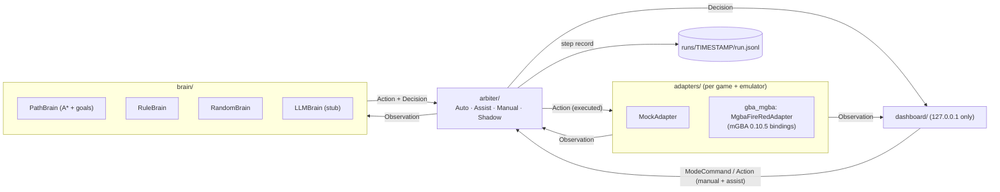

# game-brain

遊戲唔綁死嘅 AI 自動遊玩框架。第一個目標係用 mGBA 自動玩 **Pokémon FireRed 美版**。

大腦可以換：而家係規則＋尋路＋戰鬥規則，之後可以接小模型或者 LLM。操作層固定係按鍵、A* 同四種模式。人手可以隨時接手。

- **Adapter**：把遊戲變成 `Observation`（畫面、RAM、地圖）。
- **Brain**：睇 observation，出 `Action` 同人睇得明嘅 `Decision`。
- **Arbiter**：決定邊個大腦話事、動作執唔執行。模式係 Auto / Assist / Manual / Shadow。
- 每步寫入 JSONL，可以 replay。跨次記憶放喺 repo 外面。

> **ROM 唔包含在內。** 請自備合法 dump。ROM、`.sav`、savestate、截圖同 `runs/` 已寫入 `.gitignore`，唔好 commit。
>
> **請用美版 FireRed（header `BPRE`）。** 坊間中文版多數係美版打翻譯補丁，畫面可以係中文，但字庫或劇本一改，RAM 位址就可能對唔上。中文 ROM 唔當通關基準。我哋驗證過嗰隻 SHA1 係 `e0194282c427689768f8e618a285552f264524a4`，唔係乾淨 US 1.0（`41cb23d8dccc8ebd7c649cd8fbb58eeace6e2fdc`），所以位址都係逐個驗證，唔係照抄 pokefirered。


## 學習目標計劃（2026-10-06）

方向係自己提出下一個劇本目標，而唔係一次過寫完整主線。

1. 已驗證里程碑仍然由 PathBrain 跟 `goals.py`。
2. `ProbeBrain` 見到新地圖或新 NPC，就加一條 `unverified` probe。它只提議，唔寫入 `goals.json`，亦唔當完成。
3. 下一步先把 probe 交俾尋路執行。LLM 只在有 provider 之後負責把 probe 寫成可驗證劇本。
4. RL 仍未接入真 ROM。通關獎勵稀疏，未有 probe 執行政策之前不上 PPO。

啟用：`--brains battle,path,probe,rule`。預設未包括 probe。

## 點樣開

開完之後瀏覽器去 http://127.0.0.1:8765/ 。Dashboard 只綁本機，唔好改成對外。

| 你部機 | 點做 |
|---|---|
| Windows，想用 Docker | 雙擊 `start_in_docker.bat`。第一次輸入 **美版** `.gba` 路徑，之後會記住 `%USERPROFILE%\.game-brain\rom-path.txt` |
| Windows，唔用 Docker | 先裝 Python 3.10+ 同 mGBA bindings，或者先跑 `setup_local_wsl.bat`，再雙擊 `start_local.bat` |
| 已有 Python／mGBA | `export GAME_BRAIN_ROM=<美版 FireRed 路徑>`，然後 `python -m game_brain.dashboard --adapter mgba` |
| 冇 ROM，只想睇流程 | `python -m game_brain.demo --adapter mock --steps 60 --mode auto` |

預設大腦係 `battle,path,rule`。模式可以喺網頁切：Auto 全自動、Assist 人手可插隊、Manual 只人手、Shadow 只提議。右上角可選繁中或 English，預設繁中。

畫面預設每 2 步先送一次。未合併的原始畫面串流在 PR #86。Probe 唔係預設，要用 `--brains battle,path,probe,rule`。

## 方案取捨（2026-10-05）

外來方案有用，但唔會原樣照做：

- 跟：課程階段、反循環、分層獎勵、LLM 只出子目標、圖鑑先定 Kanto 151。
- 唔跟：全國 386 圖鑑。交換進化同版本獨佔喺單機做唔到。
- 唔跟：而家就換 Stable-Baselines3 做預設。未證明短局贏到劇本腦之前，深度 PPO 只係訓練選項。
- 唔跟：LLM 直接出按鍵。頻率太低，而且 LLMBrain 仍然係 stub，未接 provider。

短局入口：`python -m game_brain.rl.short --adapter mock-house`。成功條件係 `party_count` 變 1。真 ROM 用 `--adapter mgba`。

已落地的第一階段：`rl/anti_loop.py` 位置窗同連續按鍵罰（位置包含 map ID）、`rl/env.py` 可選 Gymnasium-shaped Adapter wrapper（支援由已校驗的 sidecar／state 存檔重設，恢復 frame 同 adapter state）、`rl/curriculum.py` 由出屋到第一個徽章的階段。課程訓練閉環、真正的 PPO 同 Pokédex RAG 未開始。

## 同事接手（2026-10-04）

目標次序已確認，唔好再手寫每一條路：

1. **通關第一。** 打低冠軍、入殿堂先係主獎勵。
2. **全圖鑑第二。** 新種類先加分，權重低過通關，避免為捉寵物唔去打道館。
3. 每步有時間罰。原地踏步再扣分。

實作分三段，而家只做第 1 段同 PPO 訓練入口：

| 段 | 內容 | 狀態 |
|---|---|---|
| 進度分 | `game_brain/rl/progress.py`。通關 1000、徽章 50、圖鑑種類 20、新地圖 1、重複 −0.2、每步 −0.01 | ✅ 已落地 |
| 短局按鍵權重 baseline | `python -m game_brain.rl.ppo --namespace ... --output policy.json`。CPU、全域 softmax 權重，從記錄獎勵更新；唔係 PPO，未接入執行策略 | ⚠️ 實驗入口，未跑贏劇本腦 |
| 長局 | 通關獎勵接上完整一局 | ⏳ 未做 |

預設大腦仍然係 `battle,path,rule`。劇本 PathBrain 只負責已驗證路段同對照，唔再係正式策略。短局按鍵權重 baseline 未證明可以由開機到圖鑑、再由常磐市去第一個徽章之前，唔好換做預設。

驗收：圖鑑前步數唔好差過劇本腦太多、會自己入 2 號道路、卡住會換招。全圖鑑同通關係後期目標。徽章同圖鑑 RAM 未驗證，進度分而家只會喺 observation 有呢啲欄位時先計到。

## 目前進度（2026-10-08，main `62a3fc0`）

已喺真 ROM 由開機行到：主角屋 → 真新鎮 → 研究所攞御三家 → 勁敵戰 → 1 號道路 → 常磐市，再返研究所攞圖鑑（M1／M2／M3 + `oaks_parcel`／圖鑑）。Wild／勁敵戰鬥交俾 RuleBattleBrain。輸咗會喺屋企醒，可以再行出去。存檔／續玩、live 共用 setup、`--starter random` 都已經落地。

**今日（2026-10-08）已合入 main：** #93 Docker ROM bind／copy 選項、#94 rule／random 進度 signal、#95 path route 重用＋experience-db fsync `NORMAL`、#96 實驗摘要 CLI（`python -m game_brain.experiments`，唔寫 ROM／截圖）。#96 trial-merge 真 ROM pytest：**429 passed**（約 486s）。

而家能力：預設大腦仍係 `battle,path,rule`；situation select（#91）已上 main；path cache、progress signal、experiments CLI、party 列表＋`/icons/<id>.png` 都有；`set_auto_learn` 協定已喺 server／live／setup，但 dashboard HTML **未有** Auto Learn 掣。徽章／圖鑑 RAM 仍然未驗證。

| 項目 | 狀態 |
|---|---|
| 模擬器 | ✅ mGBA 0.10.5 headless bindings；act 可重現，replay 0 mismatch |
| PathBrain | ✅ A* 尋路、避 NPC、過劇情、跳台當牆；#95 重用已算好嘅 route。Goal 17（尼比／常磐道館）未有劇本，對白完之後改為自由探索 |
| RuleBattleBrain | ✅ 讀 `ram["battle"]`，用 PokeAPI 靜態表揀招。勁敵戰已打完並返到研究所。未做換寵、道具；RUN 預設唔用 |
| RuleBrain / RandomBrain | ✅ 後備；#94 有 `ProgressSignal`。RuleBrain 過開場後只會亂行 |
| Situation select（#91） | ✅ Auto／Assist／Shadow 按情況揀低階腦（battle／path／probe／rl 次序） |
| LLMBrain | ⛔ stub，未接 provider。呼叫會 fallback |
| 存檔／續玩 | ✅ `--save-dir`／`--resume latest`、里程碑＋periodic＋final；`live.py` 同 CLI 共用 `setup.py`；`--starter random`（或固定御三家） |
| Party RAM | ✅ `ram["party"]` 解密讀取。Dashboard 隊伍列表顯示種族、等級、HP、狀態同 ROM 小圖示 `/icons/<id>.png` |
| Auto Learn | ✅ `set_auto_learn` 協定（server／live／setup／status）已喺 main。⛔ `dashboard/static/index.html` 未有 on／off 掣 |
| 實驗摘要（#96） | ✅ `python -m game_brain.experiments` 寫 JSON／markdown 去 `experiments/`；拒絕 ROM、savestate、截圖欄位 |
| 讀檔目標 | ✅ 未有第一隻就重行劇本。只得御三家就自由探索。已有之後的里程碑會保留 |
| ProbeBrain | ✅ 新地圖或 NPC 會記一條未驗證目標。唔寫入 `goals.json`，預設未啟用 |
| 靜態資料 | ✅ `goals.json`、招式表同 imitation model 用 lodis 快取。ROM、存檔、run log 不快取 |
| 學習／Go-Explore | ✅ `ExperienceMemory`（`memory.py`）＋ `go_explore.py`：tabular Q、cell archive＋savestate、跨次續跑；#95 experience-db fsync `NORMAL`。長局未全面驗證（森林以後未驗證） |
| Gym／RL env（#59） | ✅ `rl/anti_loop.py`、`rl/env.py`（Gymnasium adapter wrapper）、`rl/curriculum.py`；進度分 `rl/progress.py`。徽章／圖鑑 RAM 未驗證 |
| 短局 runner（#60） | ✅ `rl/short.py`：starter 短局（CPU），做 deep PPO 之前嘅門檻。**唔會**取代預設 `battle,path,rule` |
| PPO | ⚠️ `rl/ppo.py` 目前係未接入執行策略的全域按鍵權重 baseline，唔係 PPO。⛔ 真正 PPO／GPU 未開始 |
| Dashboard | ✅ 畫面、計劃、模式、手掣、里程碑、小地圖、戰鬥 panel、隊伍列表、繁中／英文、ROM picker、存檔。畫面有變先重畫。⛔ 未有完整 mobile layout；⛔ 未有 Auto Learn UI |
| Docker / 本機啟動 | ✅ `start_in_docker.bat`、`start_local.bat`；#93 ROM 可 bind（預設）或本機 image copy（`compose.image.yaml`）。唔好 push 含 ROM 嘅 image |
| CI / License | ✅ push 同 pull request 跑 `pytest`，真 ROM 測試會 skip。License 未揀；repo 係 **PUBLIC** |

呢隻驗證 ROM 嘅御三家只識 METRONOME（揮指），勁敵戰結果係隨機。戰鬥邏輯要讀 RAM，唔好假設識邊招。

詳細位址、實測 step 同架構見下面。

## 下一步計劃（2026-10-08）

每人一件具體下一步（README 係日更計劃嘅 source of truth）：

1. **Fullstack**：喺 main 確認 `set_auto_learn` 端到端；若 `feat/auto-learn-toggle` 已多餘就 rebase／關閉，否則補齊剩餘接線。
2. **Backend**：只喺已驗證 FireRed ROM（SHA1 `e0194282c427689768f8e618a285552f264524a4`）做徽章同圖鑑 RAM crosswalk；唔好估地址。
3. **Frontend**：喺 `dashboard/static/index.html` 加 Auto Learn on／off 掣（協定已有），並繼續 mobile layout 打磨。
4. **Designer**：為 Frontend 寫 Auto Learn 掣位置同 mobile party sidebar 版面規格。
5. **Research**：為 Backend 寫短嘅徽章／圖鑑 RAM 候選 note（只限呢隻 ROM）—列出要驗證嘅 offset，唔好估 code。

## 架構



訊息格式（`game_brain/schema`）全部係普通 JSON，帶 `type` 同 schema 版本 `v`：

| 訊息 | 方向 | 內容 |
|---|---|---|
| `Observation` | adapter → brain / dashboard | `frame`、`game`、`ram`（map bank/id、player x/y、facing…）、可選截圖 |
| `Action` | brain / 人手 → adapter | `ButtonPress(button, frames, release_frames)` 列表。**時間單位係 frame，唔係 ms**，所以可以重現 |
| `Decision` | brain → dashboard | `brain`、`plan`、`reason`、`mode`、`executed`、`actor` |
| `ModeCommand` | dashboard → arbiter | `mode` ∈ auto / assist / manual / shadow |

Dashboard 傳輸格式：`{type, frame, ts, payload}`（`to_envelope` / `from_envelope`），詳見 [`notes/dashboard-protocol.md`](notes/dashboard-protocol.md)。

## 快速開始

需要 Python ≥ 3.10。核心部分只用標準庫。

```bash
pip install -r requirements.txt        # 只得 pytest
```

### 1. Mock demo（唔使 ROM、唔使模擬器）

```bash
python -m game_brain.demo --adapter mock --steps 60 --mode auto
python -m game_brain.demo --adapter mock --steps 40 --mode shadow --switch 20:auto
python -m game_brain.demo --adapter mock --steps 20 --brains llm,rule   # LLM stub -> fallback 去 rule
python -m game_brain.demo --adapter mock-house --brains path,rule --steps 250  # PathBrain 行出合成「屋企」，再行到研究所攞御三家
python -m game_brain.dashboard --adapter mock --mode auto               # 開 http://127.0.0.1:8765/
```

### 2. 真 ROM（mGBA）

**前置條件：** mGBA 0.10.5 要由 source build，並且開 Python bindings。

- 用 `-DBUILD_PYTHON=ON -DUSE_FFMPEG=ON`。
- GCC 14 要加 `-Wno-incompatible-pointer-types`。
- 要裝 `cached_property`。
- 要裝 ffmpeg dev libs 等依賴。

完整步驟、原因同 RAM 驗證方法見 [`notes/mgba-bridge.md`](notes/mgba-bridge.md)。

喺**共用 box** 上，Backend 已經 build 好 mGBA，路徑如下（只適用於呢部 box）：

```bash
cd /workspace/game-brain            # 或者你自己嘅 clone
export PYTHONPATH=/workspace/mgba-src/build/python/lib.linux-x86_64-cpython-313
export LD_LIBRARY_PATH=/workspace/mgba-src/build
export GAME_BRAIN_ROM=<path to your FireRed ROM>   # ROM 路徑用 env 傳入，唔好放入 repo

python -m game_brain.demo --adapter mgba --steps 700 --mode auto   # headless，冇畫面
python -m game_brain.dashboard --adapter mgba                      # 開 http://127.0.0.1:8765/
```

- **Dashboard 同 CLI 共用同一套 setup**（[`game_brain/setup.py`](game_brain/setup.py)）：adapter（連 collision / NPC / 隊伍 RAM）、大腦清單、里程碑、戰鬥信心門檻、自動存檔 / 續玩都喺度砌，`demo.py` 同 `dashboard/live.py` 都用佢，旗標一樣（`--adapter --mode --brains --battle-confidence --seed --starter --out --save-dir --save-every --keep-periodic --no-save --resume`）。
- `--starter random|bulbasaur|charmander|squirtle`：**預設 `random`**（或者 `$GAME_BRAIN_STARTER`；Docker：`GAME_BRAIN_STARTER=squirtle docker compose up`）。`random` 由 seed 決定（同一個 seed 永遠揀同一隻：seed 0 → bulbasaur、1 → charmander、2 → squirtle）。**冇俾 `--seed` 就自動抽一個 seed**（`secrets.randbits(32)`），寫入 log header（`seed`、`seed_source: "auto"`）、status、summary 同存檔；用 `--seed <嗰個數>` 可以重現成個 run，`--resume` 自動用返存檔嘅 seed。固定 starter 冇 `--seed` 就照舊用 0；指定一隻就用 `--starter charmander` 等。log header、`starter` event、`starter_picked` event、dashboard `status`、summary 同每個存檔 sidecar 都有 `starter: {"requested", "picked", "seed"}`（`picked` 喺研究所攞波之前係 `null`）。`--resume` 用存檔記錄，唔會重新抽。
- Dashboard 預設：`--adapter auto`（有 `$GAME_BRAIN_ROM` 檔就用 mgba，冇就用 mock 兼喺 stderr 警告）、`--brains battle,path,rule`（同 Dockerfile CMD 一樣）。CLI 預設維持 `mock` / `rule,random`。

- 喺自己部機，將上面兩個路徑換成你 build 出嚟嘅位置（`<build>/python/lib.linux-x86_64-cpython-3XX` 同 `<build>`）。
- 可選：設定 `GAME_BRAIN_START_STATE=<file>`，每次 `reset()` 就會載入嗰個 mGBA state，唔使由開機行起。檔案放本機，`*.state` 已經 gitignore。

> ⚠️ 喺共用 box 撳 **「Update Computer」** 會清走用 apt 裝嘅 libs（例如 ffmpeg dev libs），之後 mGBA 要**重新 build**，`--adapter mgba` 先會再用得。

### Dashboard 選擇新 ROM（下次啟動使用）

遊戲畫面下方嘅 **ROM 檔案** 面板可以選擇 `.gba`，再按「保存並於下次使用」。瀏覽器唔會提供電腦原始檔案嘅完整路徑，所以程式會將 ROM **複製到本機** `~/.game-brain/roms/<SHA1>.gba`，並將該副本路徑記喺 `~/.game-brain/rom-path.txt`；可以用 `GAME_BRAIN_CONFIG_DIR` 更改目錄，唔接受 repo 內目錄。只接受 192 bytes 至 32 MiB、通過 GBA header checksum 嘅資料；只喺本機傳送，唔會傳去外部服務或加入 git。

新選擇**唔會即時切換／重置正在運行嘅遊戲**。本機請 Ctrl-C 正常停止，再啟動 Dashboard／`start_local.bat`；Dashboard 會優先用已記住嘅 ROM（包括原先由 batch file 記住嘅路徑）。`--adapter mock` 仍然係 mock，要用 `auto`／`mgba` 先會開真 ROM。新 ROM 需要相容 FireRed RAM 嘅版本；檔案 header 通過唔代表改版嘅 RAM 位址已驗證。**唔好跨 ROM 用 `--resume latest`**，原有 SHA1 校驗會拒絕唔匹配嘅存檔。

Docker Compose 將上傳副本同 pointer 存喺 `brain-config` named volume（`/config`），保存後用 `docker compose restart dashboard`。第一次 Compose 啟動仍需原有 `GAME_BRAIN_ROM_FILE` 唯讀掛載；之後 GUI 選擇嘅副本優先，唔需要修改 image。直接 `docker run --rm` 請加 `-v game-brain-config:/config`。普通重啟／重建唔會清除；**`docker compose down -v` 會刪除記住嘅路徑同上傳 ROM**。原始 ROM 同舊副本唔會自動刪除。

### Dashboard 只綁 127.0.0.1（刻意設計）

Dashboard 可以控制遊戲，所以**只會 bind 嗰部機嘅 127.0.0.1**。用 `--host 0.0.0.0` 會直接報錯拒絕，唔好試圖改成對外開放。唯一例外係喺 game-brain 嘅 Docker container 入面（見下面「Docker」），而且 host 嗰邊都係只開 127.0.0.1。

- **喺共用 box 行：** 請喺 **box 自己嘅桌面瀏覽器**打開 http://127.0.0.1:8765/。喺你自己電腦嘅瀏覽器開係連唔到嘅。
- **想喺自己電腦睇：** 喺自己部機裝 mGBA（build bindings）同 ROM，然後本機行。
- 經 SSH tunnel 遠端睇，之後先補文件。**永遠唔好 bind 0.0.0.0。**

### 3. Docker（本機用，唔使自己 build mGBA）

Image 入面會由 source build mGBA 0.10.5（開 Python bindings 同 `USE_FFMPEG`），再裝 game-brain；mGBA build 同最終 image 共用執行期套件層，避免重複安裝。測試檔同測試用範例會保留（可用 `docker run ... python3 -m pytest`），設計文件唔會放入 image。**ROM 同 save state 唔會 COPY 入 image**，淨係喺行嘅時候用 `-v ...:ro` 唯讀掛入去。Image 只喺本機用，唔好 push 去任何 registry。

喺 Windows 用 `start_in_docker.bat` 啟動時，首次會輸入 ROM 路徑並儲存到 `%USERPROFILE%\.game-brain\rom-path.txt`；之後會自動沿用。若檔案搬走或刪除，啟動時會要求輸入新路徑。ROM 路徑只保存在本機，唔會加入 repo 或 Docker image。**唔用 Docker** 請用 `start_local.bat`：優先用本機 Python + mGBA bindings，冇就用 Ubuntu WSL（唔用 Docker Desktop 嘅 distro）。Launcher 會自動揀已安裝嘅 `Ubuntu` 或唯一一個 `Ubuntu-*` 發行版（例如 `Ubuntu-F`）；唔會自動安裝 WSL。若未安裝，喺 Administrator PowerShell 用 `wsl --install -d Ubuntu --location F:\WSL\Ubuntu` 將發行版放喺 F:（需要時重啟），再雙擊 `setup_local_wsl.bat` build mGBA；完成後行 `start_local.bat`，喺 Windows 瀏覽器開 http://127.0.0.1:8765/。詳細路徑及依賴見 [`notes/mgba-bridge.md`](notes/mgba-bridge.md)。

```bash
docker build -t game-brain:local .        # 第一次大約幾分鐘（要 build mGBA）

# Dashboard（預設 `--brains battle,path,rule`）：host 嗰邊只開 127.0.0.1，開 http://127.0.0.1:8765/
docker run --rm -p 127.0.0.1:8765:8765 \
  -v /abs/path/firered.gba:/data/rom.gba:ro \
  -v "$PWD/runs":/app/runs \
  game-brain:local

# Headless demo / 測試
docker run --rm -v /abs/path/firered.gba:/data/rom.gba:ro -v "$PWD/runs":/app/runs \
  game-brain:local python3 -m game_brain.demo --adapter mgba --brains battle,path,rule --steps 2600
docker run --rm -v /abs/path/firered.gba:/data/rom.gba:ro game-brain:local python3 -m pytest -q

# 或者用 compose（設定好 ROM 路徑先）
GAME_BRAIN_ROM_FILE=/abs/path/firered.gba docker compose up --build
```

- `./runs` 要畀 uid 1000 寫得到（container 用非 root 嘅 `brain` user 行）。
- 想由某個 state 開始：加 `-v /abs/path/x.state:/data/start.state:ro -e GAME_BRAIN_START_STATE=/data/start.state`。
- Compose 會將經驗 SQLite 同探索存檔放喺 `brain-memory` named volume（container 內 `/memory`）；重建 image、重啟或普通 `docker compose down` 唔會清除。**`docker compose down -v` 會刪除記憶 volume。** 直接 `docker run --rm` 請另加 `-v game-brain-memory:/memory`，否則 container 刪除時記憶亦會消失。

**點解 container 入面要 bind `0.0.0.0`：** `-p` 會將 host 嘅 port 轉去 container 嘅網卡，唔係 container 自己嘅 loopback。如果 container 入面只 bind 127.0.0.1，host 就連唔到。所以 image 設咗 `GAME_BRAIN_IN_CONTAINER=1`，dashboard 只會喺**同時**有呢個 env 同埋有 `/.dockerenv` 或 `/run/.containerenv` 嘅時候先接受 `0.0.0.0`；其他位址（LAN IP、`::`）照樣拒絕，喺普通機設咗 env 都冇用。

**對外仍然只係 localhost：** 一定要寫 `-p 127.0.0.1:8765:8765`。**唔好**寫 `-p 8765:8765`，咁樣 Docker 會開喺 host 所有網卡上面。WebSocket 嘅 Origin 檢查冇改：`http://127.0.0.1:8765` 同 `http://localhost:8765` 通過，其他 origin 照樣 403。

## 四個模式同 `actor` 欄位

| 模式 | 問唔問大腦 | 大腦動作會唔會執行 | Dashboard / 人手按鍵 |
|---|---|---|---|
| **auto** | 問 | 會 | 拒絕 |
| **assist** | 問（除非有人手動作排緊隊） | 會（除非被人手搶先） | **接受，並且插隊優先執行**；人手動作做完，大腦自動接返 |
| **manual** | 唔問 | 唔會（brain 動作一律拒絕） | 接受，按次序執行；無排隊就原地等 |
| **shadow** | 問 | **唔會**，只記錄提議；遊戲照等同樣 frame 數 | 拒絕 |

每個 `Decision` 都有 **`actor`** 欄位，記錄呢一步實際係邊個做：

- `"brain"`：大腦出嘅動作。Shadow 模式下只係提議，`executed: false`。
- `"human"`：執行咗 dashboard / 人手排隊嘅動作。喺 Assist 即係**呢一步大腦被搶先**。
- `"none"`：原地等（Manual 冇排隊，或者冇大腦可用）。

舊 log 冇 `actor` 欄位，讀入時當 `"brain"`。

另外：
- Arbiter 有大腦優先次序，例如 `--brains llm,rule,random`。前面嘅大腦 unavailable 或者出錯，就自動 fallback 去下一個。
- 設計細節見 [`notes/design.md`](notes/design.md)。

## 跨次運行記憶與第一個學習 policy

CLI 同 Dashboard 預設累積記憶，儲存喺 `~/.game-brain/memory`（Windows：`%USERPROFILE%\.game-brain\memory`）。可用 `--memory-dir DIR` 或 `GAME_BRAIN_MEMORY_DIR` 更改，repo 內目錄會被拒絕；`--no-memory` 關閉 SQLite 同探索存檔，JSONL 仍記錄動作前後狀態。`--no-save` 關閉普通及探索存檔，但唔會關閉經驗記錄。

| 資料 | 保存內容 |
|---|---|
| `experience.sqlite3` | `runs`、`episodes`、`transitions`、`discoveries`、`cells`；每個已完成動作獨立 transaction，存 before / **實際** action / after、reward 分項、actor、mode、policy/git 版本、ROM SHA1、schema/reward 版本 |
| `exploration/<run_id>/` | 每個新 cell 嘅第一個代表 `.state` + `.json`（可有 `.sav`）；同普通 `--save-dir` 分開，唔影響普通 `--resume latest` |
| JSONL | 保留原始提議同實際動作、RAM 摘要、停止／存檔事件；無權重、無 PPO 更新 |

Cell 用精確 `(map_bank, map_id, x, y, party_count, milestones_done)`，不計 facing；戰鬥、無座標或非 overworld 唔建立 cell。`cells.visits` 跨 run 累積，可查少探索位置，再用代表存檔 `--resume <save>` 出發。記憶索引本身唔會自動選 cell；完整 Go-Explore controller、最短路徑替換同 PPO 仲未實作。存檔數隨 cell 數增長，未設淘汰上限；探索時間長時要留意磁碟容量。

首次新格 +1、新地圖 +5、planner 判定新里程碑 +10、隊伍首次達到新數量 +10。新奇獎勵按 adapter + **ROM SHA1** 跨 run 去重，來回行、讀檔、重新開機唔會重新領取；起點已存在嘅進度只做基線、唔加分。戰鬥只計明確 `outcome` 變化：同地圖／對手首次勝利 +5、明確 `lose` -10（唔用單隻 HP=0 猜全滅）；重複補血唔加分。對白／選單可唔郁，暫不猜測「卡住」或未驗證嘅 RAM 劇情旗標。呢啲係版本化嘅記錄指標，**唔係評估成績**。

Shadow 寫入實際 `NONE` 等待，experience 嘅 actor 為 `none`，唔將 AI 提議當成已執行；Manual／Assist 接管記人手動作。每次開機／`--resume` 都開新 episode，sidecar 保存父 run、episode、恢復步數。第一個任務終點為「有御三家並到達常磐市 3/1」（`terminated`）；普通結束／步數上限／訊號停止為 `truncated`。到達任務後可繼續原本運行，但後續操作屬新 episode。強制中斷／崩潰未完成步驟唔會冒充完整經驗；未正常結束嘅 run 在 SQLite 保持 `ended_at = NULL`。

### 人手示範 → 模仿學習

Manual 或 Assist 接管時，實際執行的人手動作會以 `actor=human` 記錄。訓練器只讀指定 adapter／ROM namespace 的人手 transitions，按精確觀察狀態對動作做多數決，輸出本機 JSON policy；不需要額外套件或 GPU：

```bash
# 先用 `python -m game_brain.memory` 查 namespace，再訓練
python -m game_brain.learning --memory-dir ~/.game-brain/memory \
  --namespace 'gba_mgba/firered:<ROM_SHA1>' \
  --output ~/.game-brain/memory/firered-imitation.json

# imitation 放喺 PathBrain 前：示範過的狀態重播人手選擇，其他狀態交返 PathBrain／RuleBrain
python -m game_brain.demo --adapter mgba --brains battle,imitation,path,rule \
  --imitation-model ~/.game-brain/memory/firered-imitation.json --steps 3000
```

呢個第一版只複製精確示範過的狀態；未示範或動作票數分歧就 fallback，唔會估路線。模型綁定 namespace，避免跨 ROM 錯用。佢可以接續人手已帶到的劇情／地圖，但唔會代替 Route 2、常青森林地圖驗證。無人手示範的探索模式另見下節；PPO 仍屬後續方法，詳見 [`notes/ml-decision.md`](notes/ml-decision.md)。

### 無人手示範 → 自主探索

Go-Explore runner 會按 epsilon-greedy tabular Q-learning 選擇 overworld 動作：新格子獎勵 +1、新里程碑 +5、明確通關旗標 +100；未知狀態或探索抽樣時仍用 sticky random actions。Q 值同新地圖／格子嘅 mGBA savestate 一齊寫入 archive，按新奇度和已量度劇情進度抽取存檔繼續探索。GoalPlanner 只用嚟計分 cell，唔會提供路線或選動作。Archive 同 ROM 綁定，存喺 repo 外，可重複執行指令續跑：

```bash
python -m game_brain.go_explore --adapter mgba \
  --memory-dir ~/.game-brain/go-explore --steps 2000000 --hours 8 --epsilon 0.15
```

`--epsilon` 係採取隨機探索動作的機率（預設 0.15）；`--steps` 係 archive 累積的總步數上限（續跑要提高上限）；`--hours 0` 可取消單次 wall-time 上限。可用 `--stop-map BANK/ID` 設定自訂停止地圖，但到達該地圖唔代表通關。現時 adapter 未提供通用遊戲結束旗標，FireRed 改版 ROM 的 Route 2／常青森林地圖亦未量度；因此 runner 會按步數／時間停止或等外部 `game_completed=true` 訊號，**唔會宣稱可自行完成整個 Pokémon 遊戲**。Archive 大小會隨探索 cell 數增長，請留意磁碟空間。

```bash
# 查看記憶統計、少探索 cell 同可 --resume 嘅 save 路徑
python -m game_brain.memory
# 多個 adapter / ROM 共用同一目錄時，要選輸出列出嘅 namespace
python -m game_brain.memory --namespace "gba_mgba/firered:<ROM_SHA1>"
# 匯出 cell 資料顯示嘅 run_id / step_id 到該位置嘅實際軌跡
python -m game_brain.memory --route "<run_id>:<step_id>"
# Docker Compose volume 內檢查
docker compose exec dashboard python3 -m game_brain.memory
```

`--route` 只接父軌跡至**讀檔點之前**，唔接被放棄嘅舊 run 尾段。由外來／舊存檔開始而冇父經驗時，路徑只由該 episode 起點開始，唔聲稱由開機到達；如果 sidecar 指向其他已遺失嘅記憶庫，匯出會明確報錯。備份時停程式後複製成個 memory 目錄（包含 SQLite 同探索存檔）；普通 saves 要另行備份，JSONL 仍喺 `--out`。

## Run log 同 replay

每次 demo / dashboard 都會寫 `runs/<run_id>/run.jsonl`（`run_id` = UTC 開始時間加隨機識別尾碼，例如 `20261002T083408Z-012345abcdef`，避免同秒運行覆蓋記憶／存檔）（gitignored；可以用 `--out` 改目錄）。舊 ID 照樣可以續玩。一行一筆：

- `header`：adapter、brains、mode、seed
- `step`：`step`、`frame`、`mode`、`observation`（動作前 RAM 摘要，唔包截圖）、`observation_after`（執行後重新觀察，包括最後一步）、`decision`（包括 `actor`）、`proposed_action`、`executed_action`、`frames_advanced`、`notes`；開啟記憶時亦有 `experience`（episode、獎勵分項、版本、終止旗標）
- `episode_end`：正常結束／步數上限／停止訊號嘅軌跡邊界；`iter_steps()` 將最後一步嘅 `truncated` 還原，`replay()` 亦會核對動作後狀態。舊 log 冇動作後資料仍可 replay。
- `mode_change`、`summary`

為咗慳位，log 檔入面有啲嘢只係「有變先寫」（dashboard live 收到嘅 envelope 永遠係完整，唔受影響）：

- `map`：collision / warps / map size 每張地圖寫一次，`step` 用 `observation.map_ref` 指返去
- `decision.milestones`：同上一步一樣就唔寫，`step` 改為帶 `"milestones_same": true`
- `executed_action`：同 `proposed_action` 一樣就唔寫，`step` 改為帶 `"executed_same": true`；真係冇執行動作就照寫 `"executed_action": null`

讀 log 請用 `game_brain.runlog.iter_steps()`（`replay()` 都係用佢），佢會將以上全部還原；舊 log 照讀，結果一樣。

Replay 會將 log 入面每一步嘅 `executed_action`（包括人手動作）喺一個新 reset 嘅 adapter 上重做一次，逐步比較 `frame` 同 RAM。RAM 只比較 log 入面有記錄嘅欄位：舊 log 冇嘅新欄位（例如 `controls_locked`）會跳過，所以舊 log 照樣 replay 到；log 有記錄嘅欄位就一定要一樣：

```bash
python -c "
from game_brain.runlog import replay
from game_brain.adapters import make_adapter
print(replay('runs/<timestamp>/run.jsonl', make_adapter('mock')))   # [] = 完全一致
"
```

真 ROM 嘅 log 就用 `make_adapter('mgba')`，而且要設定同上面一樣嘅 env。因為時間全部用 frame 計，又冇 wall-clock sleep，同一個起點加同一串 Action 一定得到同一個結果。範例 log：[`examples/mock_run.jsonl`](examples/mock_run.jsonl)（mock 遊戲，合成數據）。

## Save / resume（存檔同續玩）

```bash
# 預設存去 ~/.game-brain/saves（或者 $GAME_BRAIN_SAVE_DIR）；每到一個里程碑、每 500 步、同埋完結都會存
python -m game_brain.demo --adapter mgba --brains battle,path,rule --steps 3000 --save-every 500
# 由最新嗰個存檔繼續（或者俾 .json / .state 路徑）
python -m game_brain.demo --adapter mgba --brains battle,path,rule --steps 1000 --resume latest
```

- 定期存檔（`--save-every`）每個 run 只留最新 `--keep-periodic N` 個（預設 10；`0` = 全部留）；舊嘅連 `.state`、`.sav` 一齊刪。**只會刪 sidecar `reason` 係 `"periodic"` 嘅**，里程碑、`final` 同其他存檔永遠唔刪。
- `<save_dir>/latest` 記住最新存檔**相對 save dir 嘅路徑**，所以將存檔目錄搬走 / 喺 Docker（`/saves`）同 host（`~/.game-brain/saves`）之間用都可以 `--resume latest`；舊嘅絕對路徑 pointer 照讀。

- 每個存檔：`.state`（mGBA save state，主要）＋`.json` sidecar（step、frame、地圖、座標、里程碑、HP（有先有）、ROM SHA1、brains、git commit、時間）＋`.sav`（遊戲入面自己 SAVE 過先有，只係備份）。
- **停止：** Ctrl-C 或者 SIGTERM（`docker compose down`）會做完而家呢一步，再寫 `final` 存檔同 summary，exit 0。**第二次** Ctrl-C / SIGTERM 即刻強制停（例如一步卡死咗）：冇 `final` 存檔（遊戲可能停喺一步中間），用返最後一個里程碑 / 定期存檔續玩，exit code 128 + 訊號（SIGINT 130、SIGTERM 143）。
- **存檔目錄唔可以喺 repo 入面**（repo 係 public）：會直接拒絕。`--no-save` 唔存。
- 續玩：檢查 ROM SHA1 → 載入 state → 還原里程碑 → step / frame 由存檔嗰度繼續；log header 有 `resumed_from`，`replay()` 會自動由同一個 state 開始。
- Dashboard（`live.py`）用同一套旗標自動存檔 / 續玩（`--resume latest` 等）。`compose.yaml` 將 host 嘅 `${GAME_BRAIN_SAVE_DIR_HOST:-<home>/.game-brain/saves}` mount 去 container 嘅 `/saves`（`--save-dir /saves`）；Linux 要先 `mkdir -p ~/.game-brain/saves`（container 用戶係 uid 1000 `brain`，唔係就會變 root 擁有、寫唔到），`start.bat` 會自動開 `%USERPROFILE%\.game-brain\saves`。未喺 Docker 實測（box 上 docker daemon 用唔到）。
- Dashboard 啟動時會喺目前 save dir 自動載入最新、adapter／ROM 相容且完整嘅存檔。遊戲存檔面板會列出最近 20 個存檔，可直接載入其他存檔；「New Game · 重新開始」會確認後喺目前 ROM 重新開局，保留 Dashboard 同一條 log，並開新學習 episode。
- Dashboard「遊戲存檔」面板可按「載入本機 JSON 存檔」，一次揀 game-brain `.json` sidecar、sidecar 指定嘅同名 `.state`，以及（如有）`.sav`。確認後會喺下一個遊戲步驟即時取代目前遊戲狀態；adapter 同 ROM SHA1 會核對，腦會 reset 並還原 sidecar 嘅里程碑。資料只傳到本機 Dashboard，唔會寫入 repo；載入事件會記入目前 run log。
- Dashboard「新遊戲」會清除目前 mGBA 的記憶卡狀態並重新開局；此操作不會刪除磁碟上的遊戲存檔檔案。
- 格式：[`notes/savestate-format.md`](notes/savestate-format.md)。

## PathBrain（自動尋路）

```bash
python -m game_brain.demo --adapter mgba --brains path,rule --steps 1100  # 真 ROM（env 同上），行到攞到妙蛙種子
```

- **目標清單**（`game_brain/brain/goals.py`）：
  - M1：過開場（RuleBrain 狂按 A）→ 離開睡房（2F 樓梯）→ 離開屋企（1F 門口地氈）→ 企喺真新鎮。
  - M2：行去真新鎮北面出口（(12,1)，Oak 會截住你）→ Oak 劇情帶你入研究所（狂按 A）→ 揀**妙蛙種子**（左邊個波 (8,4)：企 (8,5)、面向上、撳 A、答 YES）→ `party_count` 1。
  - 之後係第一場勁敵戰：PathBrain 先用 **B** 過埋剩低嘅對白（改名問題 B = 唔要，唔會入改名畫面），再行向出口；勁敵截停之後，`in_battle` 期間由 RuleBattleBrain 打。完成 Oak 包裹同圖鑑後，第 17 個目標係往尼比市；Route 2／常青森林地圖尚未喺呢隻改版 ROM 驗證，所以 PathBrain 暫停喺 placeholder。可用 imitation policy 接續已有人手示範過的狀態。
  - 戰鬥期間 PathBrain 冇被問，但 arbiter 會俾佢 `observe` 每個 observation，所以里程碑照更新，每一步都有 `milestones`。
  - 點解揀妙蛙種子：對頭兩個道館（小剛、小霞）都有屬性優勢，最易練。改 `firered_milestones("CHARMANDER")` 就可以揀第二隻。
- **地圖**：由 `Observation.ram` 嘅 `map_w`/`map_h`/`collision`/`warps` 讀（`RamMapProvider`），每張 map 只 parse 一次。
  - `warps` 只用 `enter` 唔係 `null` 嘅。
  - Warp 格可行，就企上去撳 `enter`（地氈、樓梯）。
  - Warp 格係牆，就由後面嗰格行 `enter` 方向入去（門）。
- **每一步**：
  - 唔係面向要行嘅方向，就先輕按一下轉身；之後一個 Action 行一格。
  - 轉 map 之後，等位置穩定先再行。
  - 轉唔到身：當角色被凍結（淡入、劇情），等。
  - **NPC**：`ram["npcs"]` 入面每個 NPC 企嘅格（同佢行緊嗰陣嘅上一格）**未撞之前**已經當障礙。
  - 行唔到：先撳 A（可能係對話框）再試；同一格失敗兩次就當有 NPC 擋住，暫時封咗嗰格，再用 A\* 重新規劃（`npcs` 冇列到嘅障礙用呢個後備）。
  - **劇情**：轉唔到身 = 角色被凍結，就隔一次撳一下 A（或者目標指定嘅 B）；有步數上限，超過就交返俾後備 brain，唔會無限 loop。
- **Decision 新增**（可選，dashboard 可以畫）：`goal`、`path`（`[[x,y],…]`，第一個係現位置）、`milestones`（`[{id,label,done}]`）。PathBrain 交俾 RuleBrain 做嘅 step（例如開場），arbiter 都會抄埋 `milestones` 落去，所以**每一步都有**。
- 詳細合約同限制：[`notes/nav.md`](notes/nav.md)。

## 測試

```bash
python -m pytest -q
```

- 冇 mGBA bindings 或者冇 `GAME_BRAIN_ROM` 嘅時候，真 ROM 測試會 **skip**，其餘照跑。真 ROM 測試包括 `tests/test_mgba_adapter.py` 其中一部分，同 `tests/test_path_brain.py` 嘅「由開機行到攞到妙蛙種子」（1100 步，大約 10 秒），同 `tests/test_battle_brain_real.py` 嘅「由開機打完勁敵戰、行到常磐市、攞 Oak 包裹、返研究所攞圖鑑」，再由包裹嘅里程碑存檔 resume 一次照樣交到包裹（4300＋900 步＋replay，大約 100 秒），同 `tests/test_whiteout_real.py` 嘅「故意輸一場野生戰（只喺測試入面改 RAM）、屋企醒返再行去常磐市」（大約 70 秒）。
- 兩樣都設定好，就會全部跑。

## 目錄

```
game_brain/
  schema/       訊息 + JSON / envelope (de)serialisation
  brain/        Brain interface, RuleBrain, RandomBrain, PathBrain, goals (milestones), LLMBrain stub
  brain/battle/ RuleBattleBrain：BattleState、傷害估算、選單 compiler
  data/         PokeAPI 靜態表（屬性、種族 1–386、招式 1–354，Gen III 數值；BSD-3，見 NOTICE.md；tools/gen_pokeapi_tables.py 重新生成）
  nav/          MapGrid / MapProvider contract, RamMapProvider, A*
  arbiter/      模式處理 + brain fallback
  adapters/     Adapter interface, MockAdapter, MockHouseAdapter (合成地圖，包括 M2 研究所同假勁敵戰), MockBattleAdapter (合成戰鬥，`ram["battle"]` 同真 ROM 一樣形狀), gba_mgba/ (MgbaFireRedAdapter + FireRed RAM map；firered_extra.py = M2 暫用 reader)
  dashboard/    本機網頁 dashboard（HTTP + WebSocket，只用標準庫）+ live loop
  runlog.py     JSONL writer / reader / replay
  demo.py       end-to-end loop CLI
examples/mock_run.jsonl   細份合成 run log（mock 遊戲，無遊戲數據）
notes/          design.md, adapter-interface.md, mgba-bridge.md, dashboard-protocol.md, nav.md, references.md, ml-decision.md
tests/          pytest
```

## Roadmap（第 0–2 週目標：由真新鎮行到常青市道館門口）

1. ✅ **驗證 `in_battle`**（PR #15）。**下一步**：驗證 `ram["battle"]`（選單/游標狀態、雙方 HP、等級、招式、PP；清單見 [`notes/battle-brain.md`](notes/battle-brain.md)），同埋補驗 `npcs`、確認輸咗勁敵戰劇情係咪照行。
2. **行路大腦**：✅ M1 完成（行到真新鎮）；✅ M2 完成（Oak 劇情 → 研究所 → 妙蛙種子）。下一步：
   - ✅ 第一場勁敵戰（行向出口觸發，RuleBattleBrain 打）；
   - ✅ M3：真新鎮 → 1 號道路 → 常磐市（行出 map 邊界；野生戰由 RuleBattleBrain 打）。下一步：常磐市友好商店攞 Oak 包裹；
   - 單向格（ledge）同方向性阻擋；
   - 跨 map 規劃：而家淨係「行出指定方向嘅邊界」，未讀 `gMapHeader.connections`（等 Backend）。
3. **戰鬥大腦**：✅ RuleBattleBrain（PokeAPI 表＋傷害估算，`--brains battle,path,rule`，信心門檻預設 0.6）。下一步：dashboard 顯示 `intent`/`battle`/`battle_options`/`confidence`/`handoff`；野生戰（RUN）、換隻同道具要等隊伍/背包 RAM 驗證。
4. **LLM planner / Jev**：要 YIN 揀 provider、批預算、喺 1:1 用安全輸入俾 API key 之後先做。
5. **ML**（M2 有戰鬥數據之後）：Go-Explore 式 savestate 探索 → 人手 log 模仿學習 → PPO（見 [`notes/ml-decision.md`](notes/ml-decision.md)）。
6. **CI**：token 有 `workflow` scope 之後先加 GitHub Actions，跑 `pytest`（mock 部分）。

參考資料：[`notes/references.md`](notes/references.md)、學習型決策評估 [`notes/ml-decision.md`](notes/ml-decision.md)（Research Manager 整理）。
