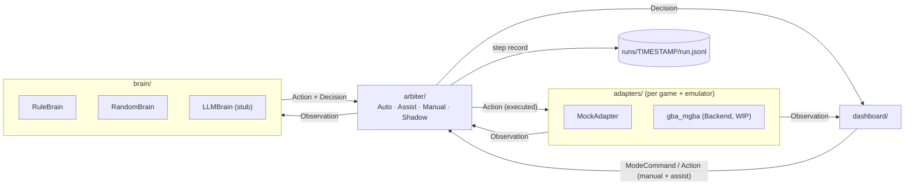

# game-brain

A game-agnostic **"AI brain" for auto-playing games**. Adapters turn a running game into
`Observation`s; brains turn observations into `Action`s (+ a human-readable `Decision`);
an arbiter decides which brain is in charge and whether its action really runs
(Auto / Assist / Manual / Shadow). Every step is written to a JSONL run log that can be replayed.

First target: **Pokémon FireRed (US 1.0) on mGBA** — the mGBA bridge is being built separately
by Backend; this repo currently ships a **MockAdapter** so everything runs end-to-end without
an emulator.

> **ROM not included.** Supply your own legally-dumped ROM. ROMs, saves, savestates,
> screenshots and run artifacts are gitignored and must never be committed.

## Architecture



Messages (`game_brain/schema`), all plain JSON with a `type` and schema version `v`:

| message | direction | content |
|---|---|---|
| `Observation` | adapter → brain/dashboard | `frame`, `game`, `ram` (map bank/id, player x/y, facing, in_battle, …), optional screenshot path/base64 |
| `Action` | brain/manual → adapter | list of `ButtonPress(button, frames, release_frames)` — **durations in frames**, not ms |
| `Decision` | brain → dashboard | `brain`, `plan`, `reason`, `mode`, `executed` |
| `ModeCommand` | dashboard → arbiter | `mode` ∈ auto/assist/manual/shadow |

Dashboard transport: `to_envelope(msg, frame)` → `{type, frame, ts, payload}` (and `from_envelope`).
Dashboard actions are accepted in **Manual** and **Assist** (where they preempt the brain);
Auto and Shadow reject them. `Decision.actor` (`brain` / `human` / `none`) records who acted.

## Dashboard

```
python -m game_brain.dashboard --adapter mock --mode auto
# open http://127.0.0.1:8765/
```

Shows the live game view (or a grid from RAM coordinates when the adapter has no
screenshots), the current plan, recent steps (with who acted), and a mode switch. In **Manual** and **Assist** mode the
on-screen pad and the keyboard (arrows, Z=A, X=B, Enter=START, Shift=SELECT) send button
presses. Loopback only. Wire contract: `notes/dashboard-protocol.md`.

## Layout

```
game_brain/
  schema/       messages + JSON / envelope (de)serialisation
  brain/        Brain interface, RuleBrain, RandomBrain, LLMBrain stub
  arbiter/      mode handling + brain fallback
  dashboard/    local web dashboard (HTTP + WebSocket, stdlib only) + live loop
  adapters/     Adapter interface, MockAdapter  (mGBA bridge: Backend)
  runlog.py     JSONL writer / reader / replay
  demo.py       end-to-end loop CLI
examples/mock_run.jsonl   small synthetic run log (mock game, no game data)
notes/          design.md, adapter-interface.md, references.md
tests/          pytest (no ROM/emulator needed)
```

## Run

Python ≥ 3.10, standard library only at runtime.

```bash
pip install -r requirements.txt        # pytest only
python -m pytest -q

# end-to-end demo on the mock game (writes runs/<timestamp>/run.jsonl, gitignored)
python -m game_brain.demo --adapter mock --steps 60 --mode auto
python -m game_brain.demo --adapter mock --steps 40 --mode shadow --switch 20:auto
python -m game_brain.demo --adapter mock --steps 20 --brains llm,rule   # LLM stub -> falls back to rule
```

When the mGBA adapter lands, the ROM path will be passed via `--rom` / `GAME_BRAIN_ROM`
(never stored in the repo).

## Status / not yet done

* mGBA FireRed adapter — Backend (see `notes/adapter-interface.md` for the contract).
* LLMBrain — stub only, makes no API calls.
* CI — not set up yet (the current token cannot push `.github/workflows`).
* License — none chosen yet (private repo); to be decided by the team.
